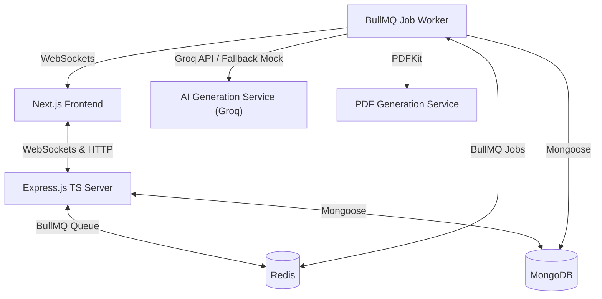

# VedaAI: Assessment & Question Paper Creator

VedaAI is a full-stack, enterprise-grade AI Assessment Creator based on the approved technical designs. It allows teachers to specify parameters, generate high-fidelity, structured exam papers asynchronously using the Groq Llama 3 API, customize print formats, reveal answer rubrics, and run student exam simulations in real time.

---

## 🌟 Premium Creative & Bonus Features

We have built five high-value creative and functional enhancements into VedaAI to provide a state-of-the-art product experience:

1.  **🔑 AI-Generated Answer Key & Rubrics (Teacher Mode)**: Along with generating questions, the worker generates step-by-step solutions. Toggle them on/off instantly with a single button click.
2.  **📡 Live Queue Log Streams via WebSockets**: Real-time feedback showing exact steps being performed by the background BullMQ workers in a gorgeous log console (e.g. `[1/5 Queue] connected...`, `[3/5 AI Engine] Balancing difficulty...`).
3.  **✏️ Manual Inline Editing & Single Question Re-rolls**: The teacher isn't locked into what the AI generated. Hover to edit question text inline, or click a single button to re-roll/regenerate *only* that specific question on the fly!
4.  **⏱️ Student Exam Mode Simulator**: Switch the entire assessment view into a clean student exam terminal complete with countdown timers, answer fields, and response compilation alerts.
5.  **🖨️ Customizable PDF Compiler Engine**: Customize the School Name and Exam Term on-screen. Clicking compile instructs the PDFKit engine to regenerate a perfect academic paper with appropriate bordered boxes and outlines.

---

## 🛠️ Technology Stack

*   **Frontend**: Next.js 14 (App Router), React 18, TypeScript, Zustand (Unified state + WS integrations)
*   **Backend**: Node.js, Express, TypeScript, Mongoose, WebSocket (`ws`)
*   **Background Jobs & Cache**: BullMQ + Redis
*   **Database**: MongoDB
*   **AI Engine**: Groq API SDK (using `llama-3.3-70b-versatile` in JSON mode) with a robust simulated AI fallback if no keys are defined.

---

## 🏗️ Architecture Workflow



1.  **Frontend Form Submission**: The teacher submits the parameters via Next.js.
2.  **API Handler**: The Express server saves the initial document and pushes a `generate-assessment` job to BullMQ in Redis.
3.  **BullMQ Worker Pool**: A background worker handles the queue.
    *   Fires a call to Groq's high-speed API requesting strict JSON output.
    *   Validates and parses the sections, difficulties, and answer key parameters.
    *   Stores sections back in MongoDB and enqueues a `generate-pdf` job.
    *   Pushes live WebSocket log progress reports (`JOB_PROGRESS`) to all active dashboard clients.
4.  **PDF Compiler**: The worker compiles a print-ready, professional exam sheet using `pdfkit` and stores it.
5.  **WS Client Alert**: The frontend receives a `ready` packet, plays a confetti burst, and routes the teacher to the workspace immediately.

---

## 🚀 Local Installation & Quick Start

Follow these simple steps to launch VedaAI on your machine:

### **1. Prerequisites**
*   Node.js (v18+)
*   Docker & Docker Compose (optional, but highly recommended for launching databases with one command)

---

### **2. Launch Local MongoDB & Redis**
If you have Docker running, launch the database container dependencies in the workspace root:
```bash
docker compose up -d
```
*This spins up localized Redis on `6379` and MongoDB on `27017`.*

---

### **3. Setup & Start Backend Server**
1.  Navigate to the `/backend` directory:
    ```bash
    cd backend
    ```
2.  Install dependencies:
    ```bash
    npm install
    ```
3.  Configure environment variables in `.env` (optional: add your `GROQ_API_KEY` for real llama 3 assessment generators):
    ```env
    PORT=5000
    MONGODB_URI=mongodb://localhost:27017/vedaai
    REDIS_HOST=localhost
    REDIS_PORT=6379
    GROQ_API_KEY=your_groq_api_key_here
    ```
    *(Note: If you leave `GROQ_API_KEY` empty, VedaAI automatically runs in **Mock Generation Mode**, generating highly realistic topic-matching questions so you can test all features instantly out of the box!)*
4.  Launch the development server:
    ```bash
    npm run dev
    ```
    *The API will start running on http://localhost:5000 and mount WebSocket log broadcasters.*

---

### **4. Setup & Start Next.js Frontend**
1.  Open a new terminal window and navigate to `/frontend`:
    ```bash
    cd frontend
    ```
2.  Install dependencies:
    ```bash
    npm install
    ```
3.  Launch the development server:
    ```bash
    npm run dev
    ```
4.  Open http://localhost:3000 in your browser to experience VedaAI!

---

## 🧪 Verification & Manual Testing Guidelines

1.  **Dashboard State**: Load http://localhost:3000 to see the Figma empty dashboard ("No assignments yet").
2.  **Build Assessment**: Click `Create Your First Assignment` or `Create Assignment` in the sidebar. Fill in:
    *   Title: "Quiz on Electricity" (or "Math Examination").
    *   Pick checkbox parameters: e.g. MCQ, Short Answer.
    *   Input Questions: 6, Marks: 5.
    *   Submit the form.
3.  **Real-Time Log Stream**: You will be immediately locked into the VedaAI Generation Terminal showing dynamic background queue logs pushed via WebSockets from Redis workers.
4.  **Confetti & Redirect**: Once compiled, standard confetti sparks, and you are automatically routed to the exam paper!
5.  **Inline edits & Re-rolls**: Hover over any question to edit its text, or hit the refresh icon to re-roll just that question.
6.  **Answer Key Toggle**: Press "Reveal Answer Keys" to show AI Solutions and grading rubrics.
7.  **Student Simulator**: Switch the tab to Student Mode. Notice that timer starts, response fields unlock, and teacher editing tools disappear.
8.  **Custom Headers**: Change "Delhi Public School" to your own school name, click "Update PDF Header", then click "Download perfect PDF" to view the beautifully formatted compiled sheets!
